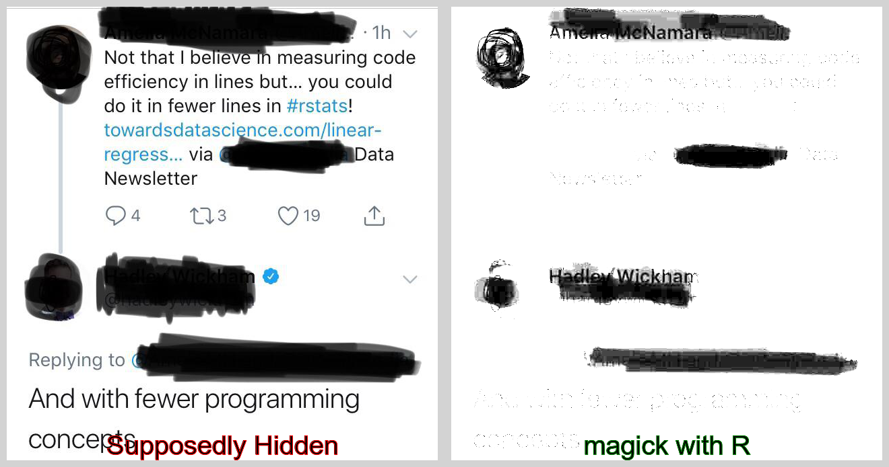

Magick Eraser with R
====================

I am always intrigued by these kind of Black markers used to hide some
information. So a tiny attempt to see if `magick` can do some **magic
with R**

    library(magick)

    ## Linking to ImageMagick 6.9.9.39
    ## Enabled features: cairo, fontconfig, freetype, lcms, pango, rsvg, webp
    ## Disabled features: fftw, ghostscript, x11

    image <- image_read("tweet_linkedin.jpeg")

    image %>% 
     image_channel() %>% 
      image_modulate(brightness = 350) %>% 
      image_quantize(max = 80)  %>% 
      image_modulate(brightness = 500)  -> new

    images <- c(image %>% image_annotate("Supposedly Hidden", size = 40, gravity = "South", strokecolor = "red") , 
                new %>%   image_annotate("magick with R", size = 40, gravity = "South", strokecolor = "green"))

    image_append(images)

